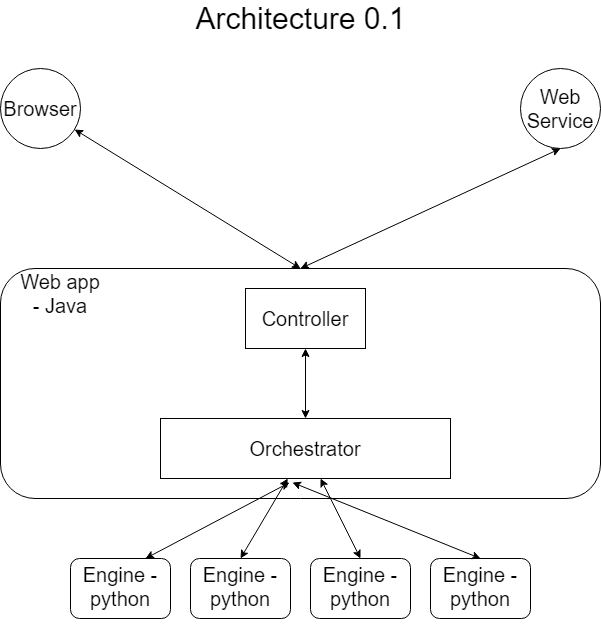

# Machine Learning Swissknife

The aim of this application is to make machine learning accessible for everyone. A user with a set of data wants to have a calculated prediction, estimation or forecast will be able to do so with this very simple webapplication.

## Pull request requirements

We expect all pull requests to follow the best practices and maintain high quality and readable code.

We have set up a requirements tab in order to maintain quality.

> [Requirements](resources/documentation/md/PullRequestRequirements.md)

## Tasks & todos

We exported our Kanban board and we intend to keep it up to date

> [Tasks](resources/documentation/md/TasksAndTodos.md)

## Architecture

Below is the architecture of this application (Components might be added while developing this platform).



> - The Web app will be developped in Java using spring framework
> - The calculation engines are seperate  spawnable webservices developed in python using flask and sklearn (Python3)
> - The aim is dockerize all components

## Components

> - [Api](resources/documentation/md/Api.md)
> - [Engine](./resources/documentation/Engine.md)
> - [Service](./resources/documentation/Service.md)
> - [Web UI](./resources/documentation/WebUI.md)

## Package and run

We worked hard to make machine learning easy and accessible for everyone. Packaging and running the solution should also be easy.

> [Package & run](resources/documentation/md/PackageAndRun.md)

## Miscellaneous

* To find process that is listening/using a port
  ```bash
  lsof -i tcp:6765 
  ```

* Date Formatter
  * Java
    ```text
    https://docs.oracle.com/javase/8/docs/api/java/time/format/DateTimeFormatter.html
    => "Patterns for Formatting and Parsing"
    ```
  * Python
    ```text
    https://docs.python.org/3/library/datetime.html
    => "strftime() and strptime() Format Codes"
    ```
  * Angular
    ```text
    https://angular.io/api/common/DatePipe
    => "Custom format options"
    ```

## Contributors

- Joe ABDELNOUR
- Ramy EID
