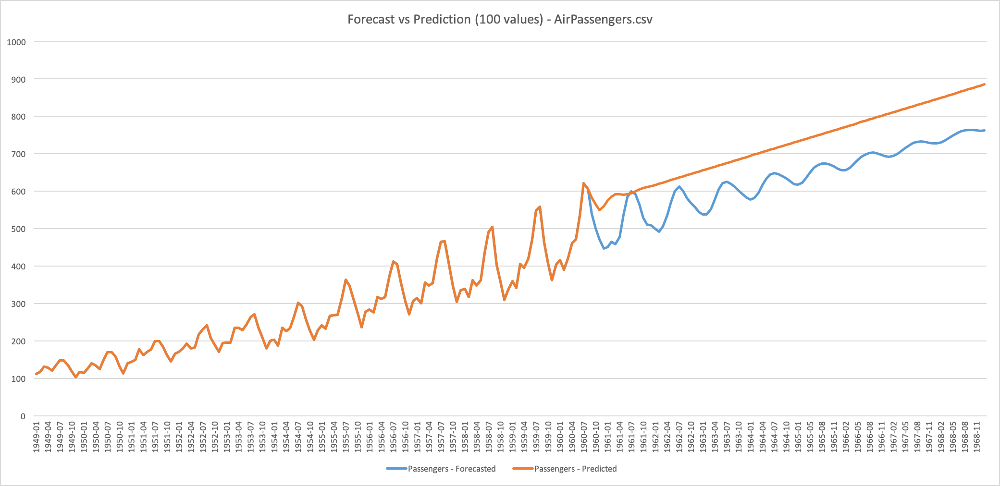

# Time Series Analysis Service

Extract values at a certain rate and a certain time interval and predict according to the variation of the parameters that is being evaluated.

This Services offers two end points; forecast and predict



## Forecast

```time-series-analysis/forecast```

To forecast once the exact values to come.
If a user wants to have an approximate value of the next x time. The forecasted values will enter in the computation for the next value.

## Predict

```time-series-analysis/predict```

Predict the slope of the data to come for the next x time. In fact,a user will want to know if, with the values will increase, decrease or stay stable for the following months.

## Accuracy for Forecast

```time-series-analysis/forecast-accuracy```

Compute accuracy for Forecast.
Given a csv input this service will compute the last x values and compare them to the actual value.

## Python Documentation

``` bash
python3 -m pydoc time_series_analysis_service
```

## How to

Locally launch the engine service

```bash
python3 engine.py --port 6767
```

* Predict

    ```bash
    curl -d 'csv=//Users//ramyeid//Documents//machine-learning-swissknife//resources//data_example//AirPassengers.csv&date_column_name=Date&value_column_name=Passengers&date_format=%Y-%m&number_of_values=100' http://localhost:6767/time-series-analysis/predict
    ```

* Forecast

    ```bash
    curl -d 'csv=/Users/ramyeid/Documents/machine-learning-swissknife/resources/data_example/AirPassengers.csv&date_column_name=Date&value_column_name=Passengers&date_format=%Y-%m&number_of_values=5' http://localhost:6767/time-series-analysis/forecast
    ```

* Accuracy for Forecast

    ```bash
    curl -d 'csv=/Users/ramyeid/Documents/machine-learning-swissknife/resources/data_example/AirPassengers.csv&date_column_name=Date&value_column_name=Passengers&date_format=%Y-%m&number_of_values=5' http://localhost:6767/time-series-analysis/forecast-accuracy
    ```
