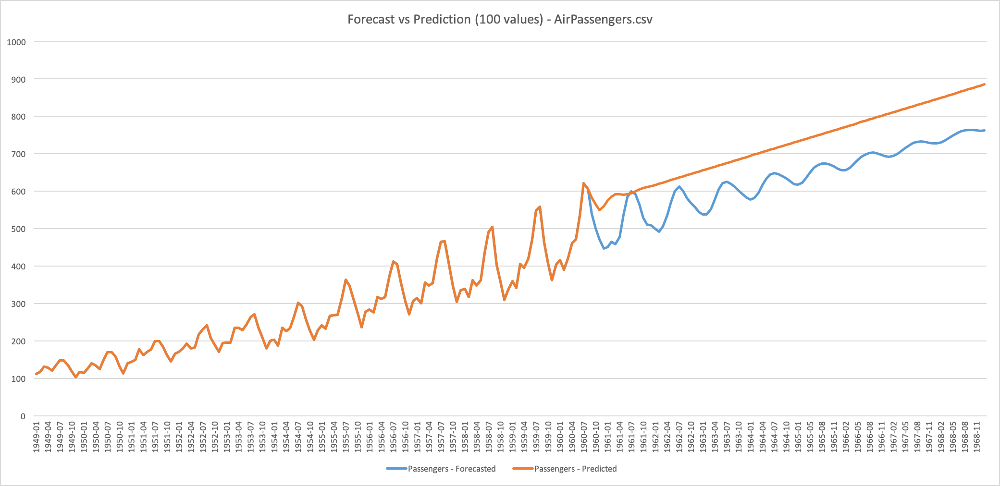

# Time Series Analysis Service

Extract values at a certain rate and a certain time interval and predict according to the variation of the parameters that is being evaluated.

This Services offers two end points; forecast and predict



## Forecast

```time-series-analysis/forecast```

To forecast once the exact values to come.
If a user wants to have an approximate value of the next x time. The forecasted values will enter in the computation for the next value.

## Predict

```time-series-analysis/predict```

Predict the slope of the data to come for the next x time. In fact,a user will want to know if, with the values will increase, decrease or stay stable for the following months.

## Accuracy for Forecast

```time-series-analysis/forecast-accuracy```

Compute accuracy for Forecast.
Given a csv input this service will compute the last x values and compare them to the actual value.

## Python Documentation

```bash
python -m pydoc time_series_analysis_service
```

## Debug Service

We created a under engines/debug a python file: time_series_analysis_engine_debug.py
which will let you instead of launching all the components debug the engine seperately.
The three methods are also offered in this small python script:

* Predict

    ```bash
    python time_series_analysis_engine_debug.py --csv //Users//ramyeid//Documents//machine-learning-swissknife//resources//data_example//AirPassengers.csv --dateColumnName Date --valueColumnName Passengers --dateFormat '%Y-%m' --numberOfValues 100 --action PREDICT [--output //Users//ramyeid//Documents//machine-learning-swissknife//resources//data_example//AirPassengers_predict_output.csv]
    ```

* Forecast

    ```bash
    python time_series_analysis_engine_debug.py --csv //Users//ramyeid//Documents//machine-learning-swissknife//resources//data_example//AirPassengers.csv --dateColumnName Date --valueColumnName Passengers --dateFormat '%Y-%m' --numberOfValues 3 --action FORECAST [--output //Users//ramyeid//Documents//machine-learning-swissknife//resources//data_example//AirPassengers_predict_output.csv]
    ```

* Accuracy for Forecast

    ```bash
    python time_series_analysis_engine_debug.py --csv //Users//ramyeid//Documents//machine-learning-swissknife//resources//data_example//AirPassengers.csv --dateColumnName Date --valueColumnName Passengers --dateFormat '%Y-%m' --numberOfValues 3 --action FORECAST_ACCURACY
    ```
