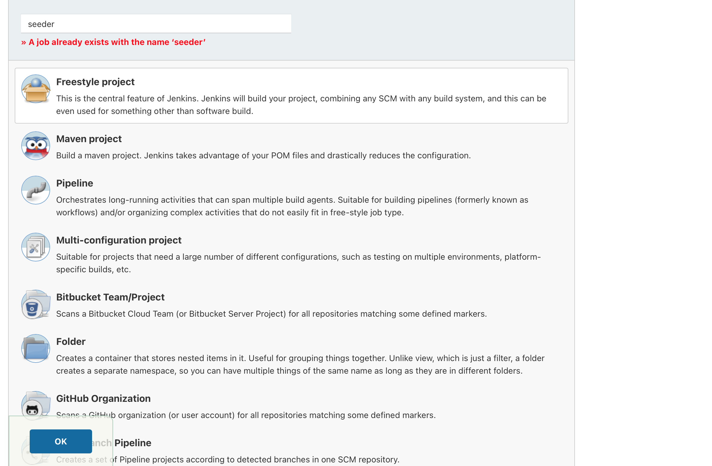
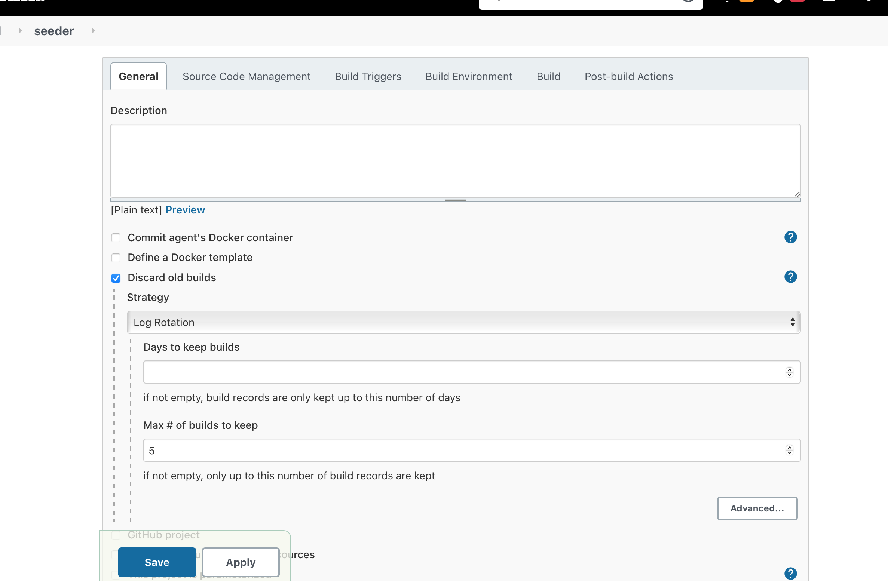
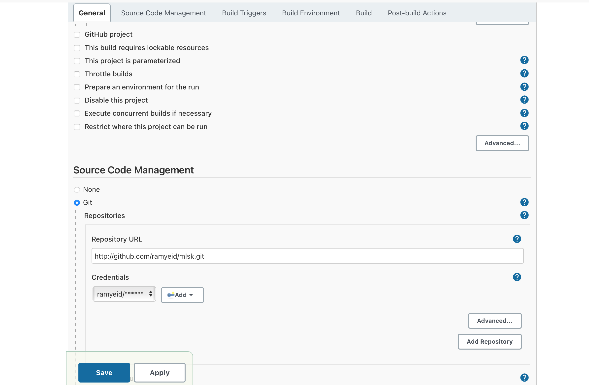
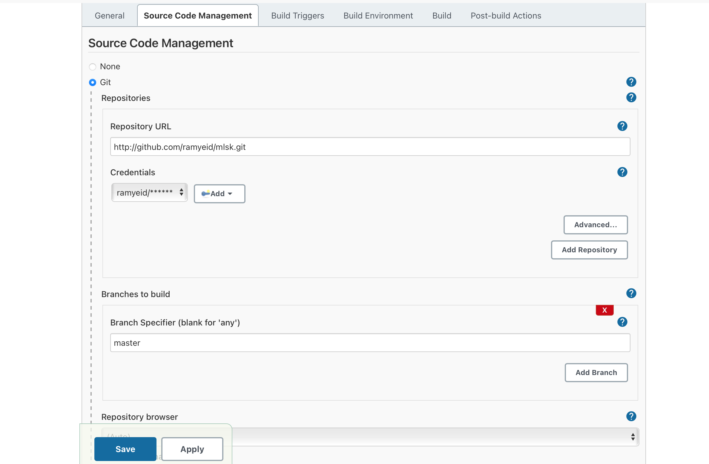
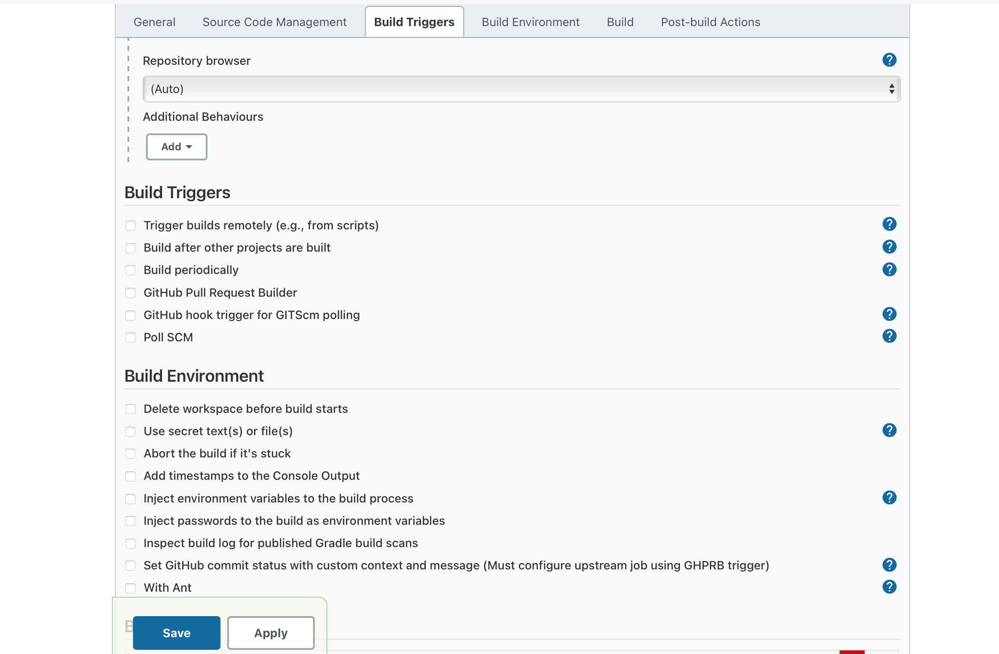
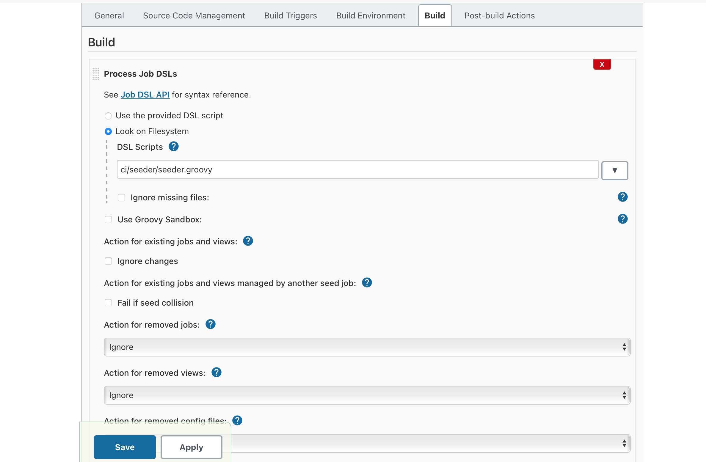
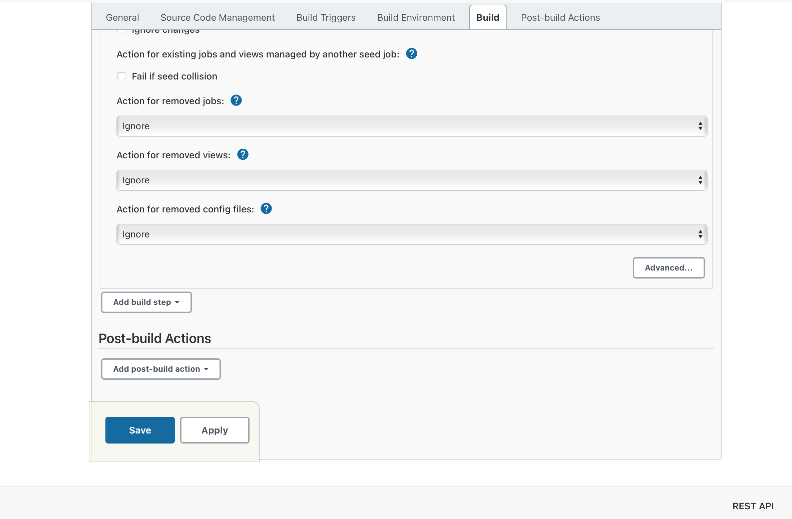

# Continuous Integration - Seeder

In order to make it simpler to run the [pipeline](Pipeline.md), we decided to create a [seeder](../../../../../ci/seeder/seeder.groovy) that will enable us to create a multi branch pipeline.

## Content

The seeder contains all the configuration needed to create a multi branch pipeline job with _script path_ being our pipeline

## Configuration

To create a configure a seeder job

1. Create Freestyle Project
  
2. Configure seeder job
  
  
  
  
  
  

## Reference

[API of Jenkisn DSL](https://jenkinsci.github.io/job-dsl-plugin/#path/job)

[Multi branch pipeline](https://www.jenkins.io/doc/book/pipeline/multibranch/)

[How to create seeder](https://www.serverlab.ca/tutorials/dev-ops/automation/how-to-seed-jenkins-build-jobs/)
