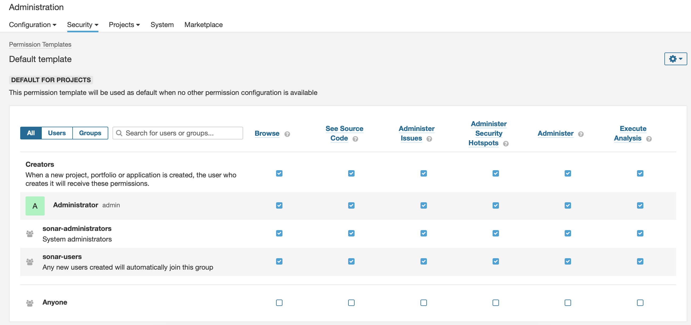
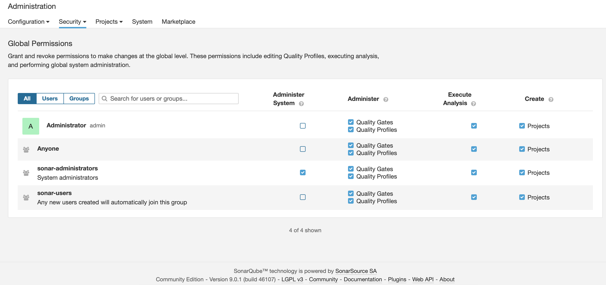
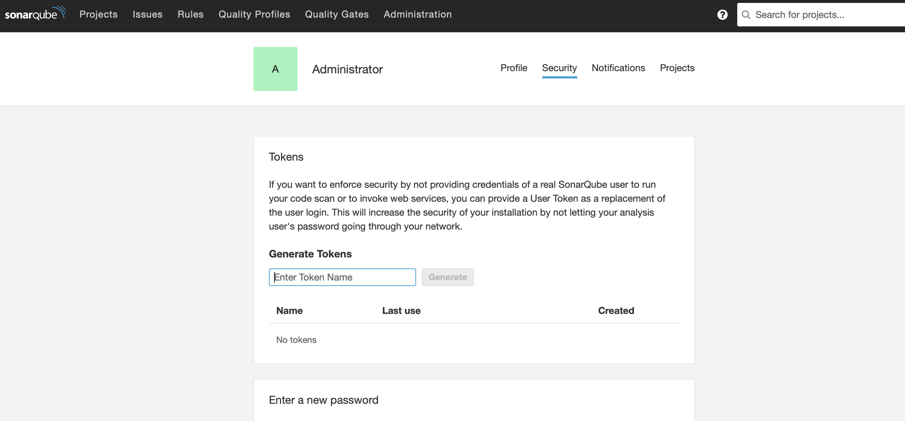
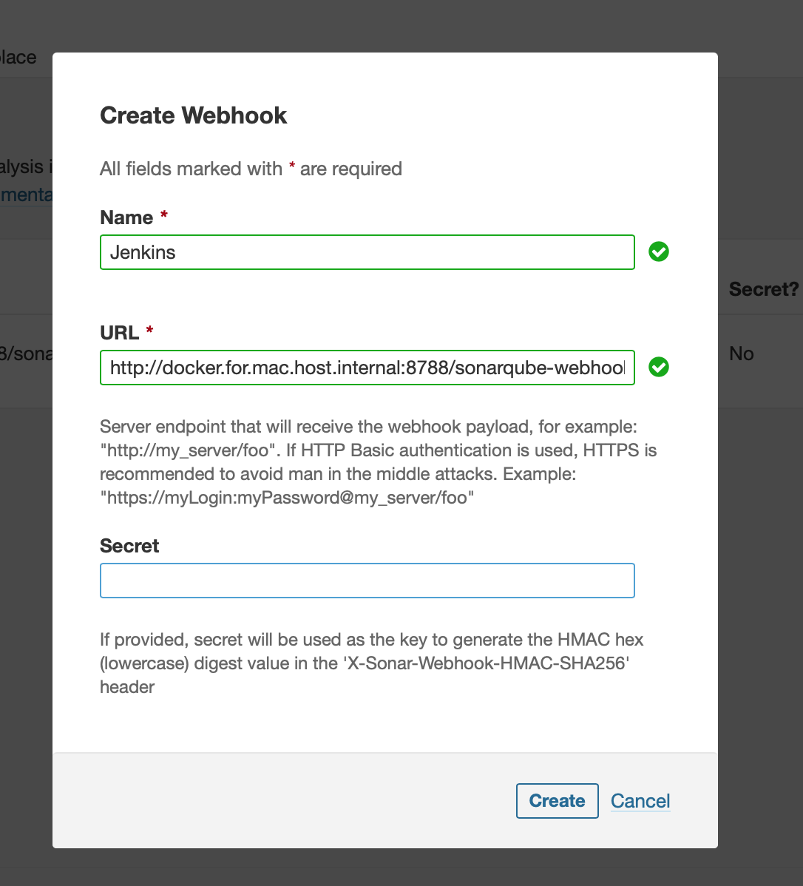
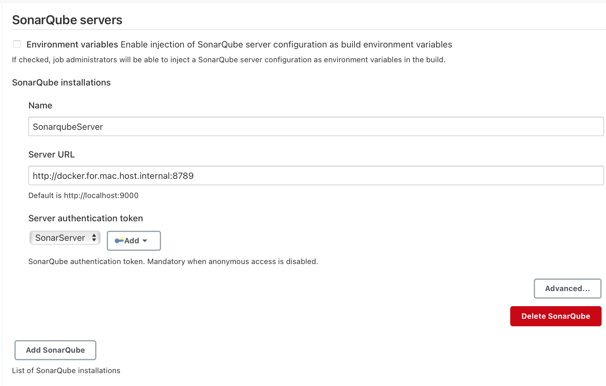
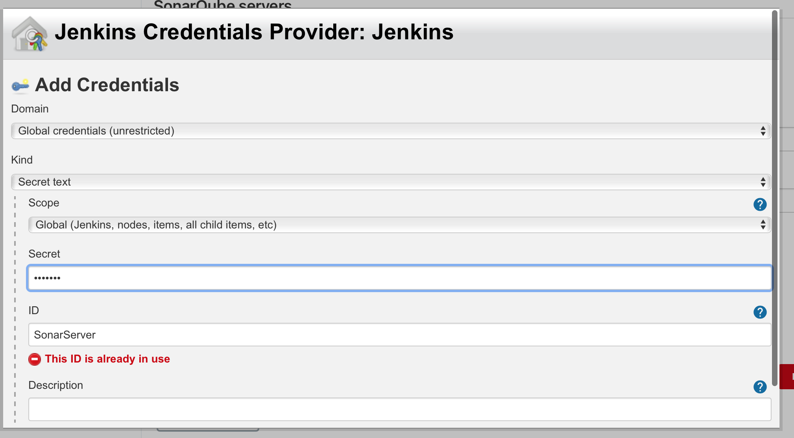

# Continuous Integration - Sonar

Our [pipeline](Pipeline.md) publishes and checks quality gate on Sonar.

Sonar Static code analysis, is already [deployed](Deployment.md) with jenkins

## Configuration

1. In Sonar, make sure that your user has the rights to execute analysis for template

    _Administration > Security > Permission Templates > Default Template_
    

2. In Sonar, make sure that your user has the rights to execute analysis for global permission

    _Administration > Security > Global Permissions_
    

3. In Sonar, generate token

    _My Account > Security > Generate Token_
    

4. In Jenkins, link the token and create a sonarqube configuration

    _Manage Jenkins > Configure System > SonarQube servers_
    

5. Create Secret Text Credentials

    

6. Configure a webhook in Sonar

    _Administration > Configuration > Webhooks > Create_
    
    **URL**:

    ```text
    http://docker.for.mac.host.internal:8788/sonarqube-webhook/
    ```

## Reference

[SonarScanner](https://docs.sonarqube.org/latest/analysis/scan/sonarscanner-for-jenkins/)

[Sonar in pipeline](https://www.jenkins.io/doc/pipeline/steps/sonar/)

## Remarks

> maven projects have to be build with mvn clean install for sonar to work.
