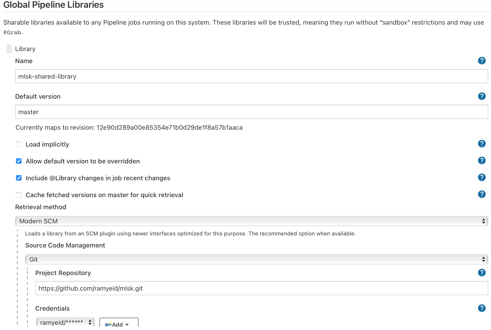
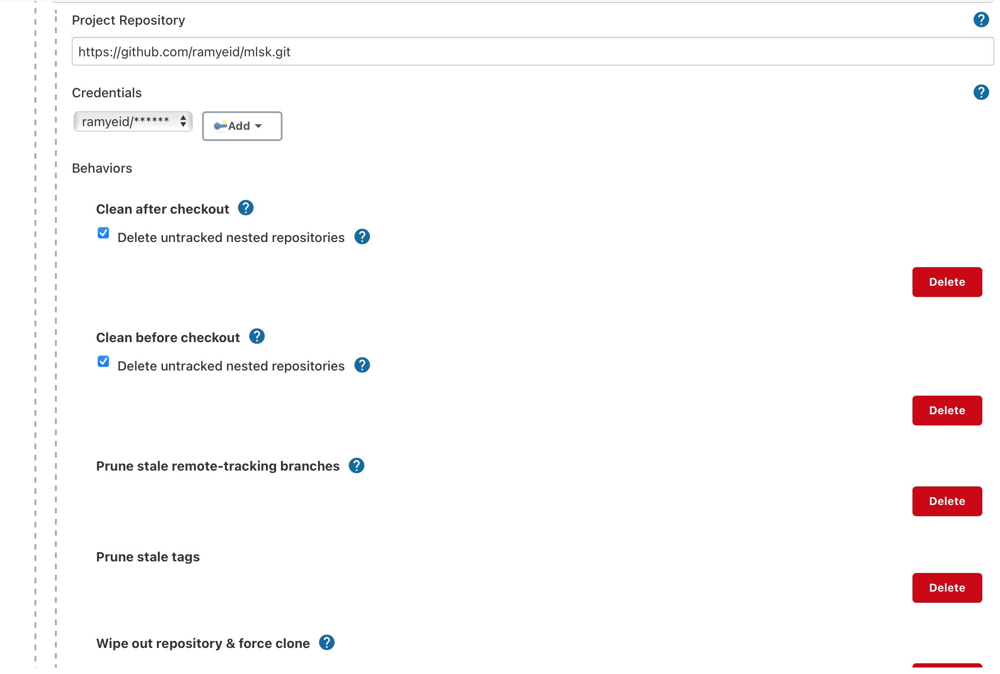
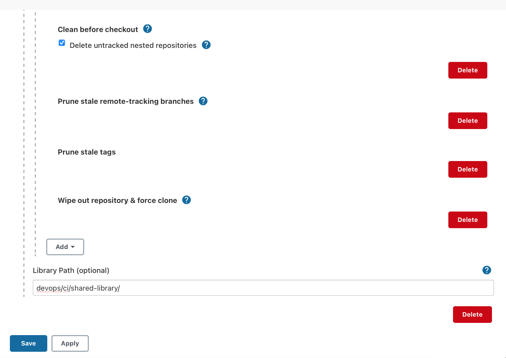

# Continuous Integration - Shared Library

We created a [shared library](../../../../../../devops/ci/shared-library) in jenkins in order to reuse and test some functionality as well as write clean declarative pipeline.

The shared library consists of:

- [vars](../../../../../../devops/ci/shared-library/vars) folder containing the methods that will be able to call in jenkins pipeline.

- [src](../../../../../../devops/ci/shared-library/src) folder containing the implementations of these methods

## Configuration

In order to configure a shared library we need to go to _Dashboard > Manage Jenkins > Configure System_

> **Name**: mlsk-shared-library \
> **Default version**: master \
> **Project repository**: ```https://github.com/ramyeid/mlsk.git``` \
> **Library path**: devops/ci/shared-library/





## Reference

[Shared Library](https://www.jenkins.io/doc/book/pipeline/shared-libraries/)
