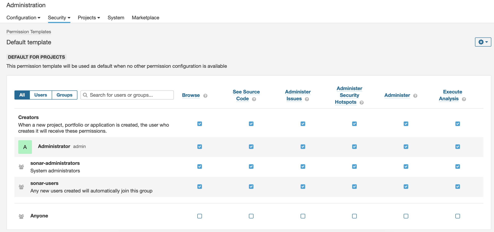
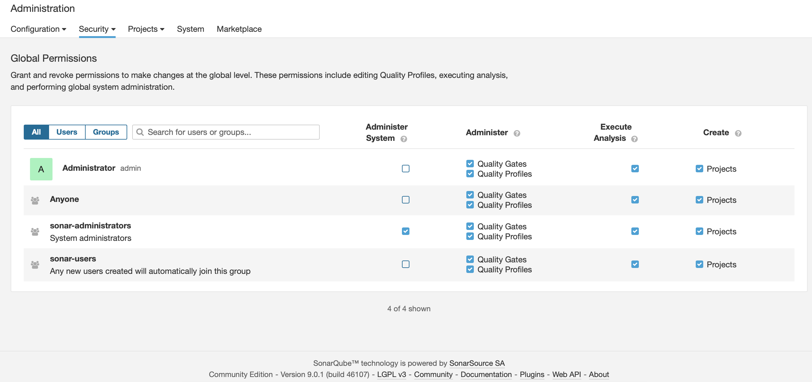
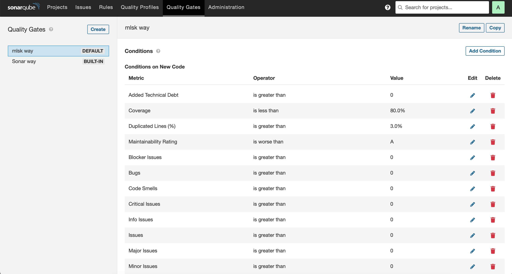
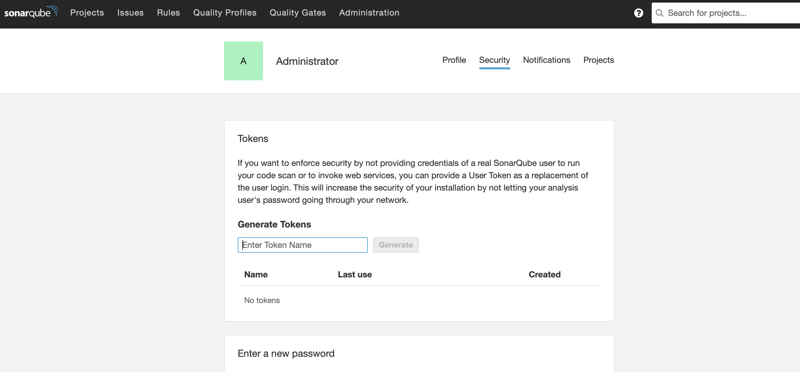
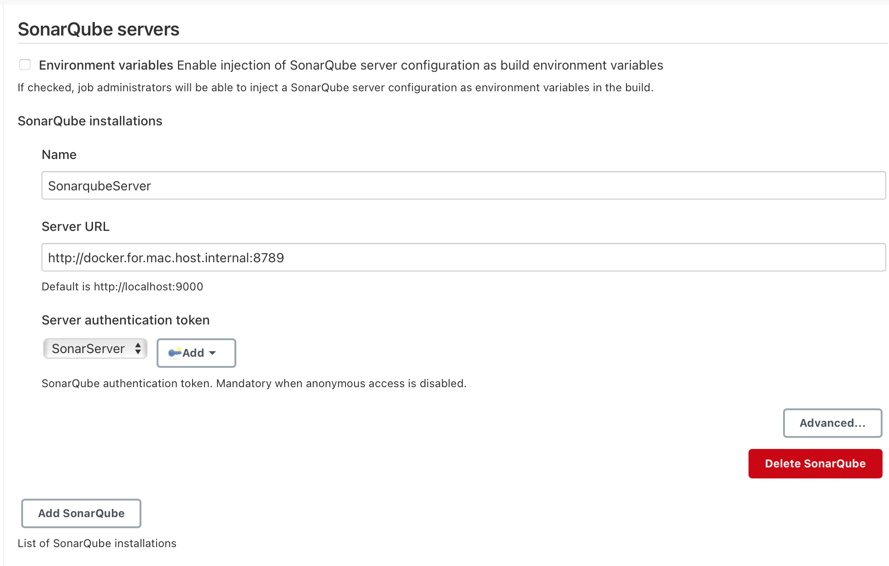
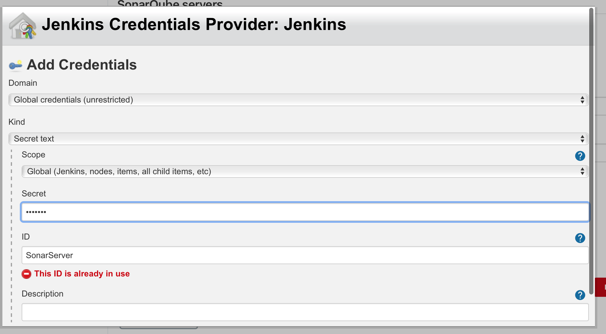
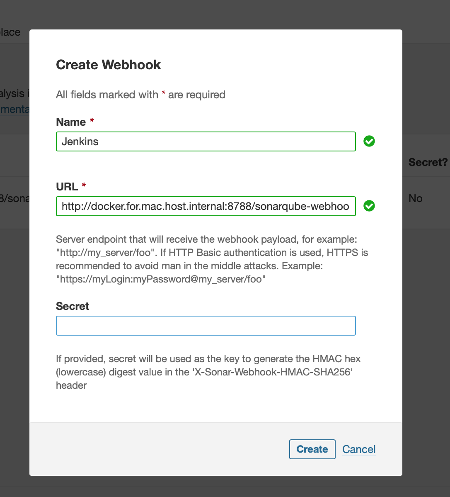

# Continuous Integration - Sonar

Our [pipeline](Pipeline.md) publishes and checks quality gate on Sonar.

Sonar Static code analysis, is already [deployed](Deployment.md) with jenkins

## Configuration

1. In Sonar, make sure that your user has the rights to execute analysis for template

    _Administration > Security > Permission Templates > Default Template_
    

2. In Sonar, make sure that your user has the rights to execute analysis for global permission

    _Administration > Security > Global Permissions_
    

3. In Sonar, Create your own Quality Gate

    _Quality Gates_
    

4. In Sonar, generate token

    _My Account > Security > Generate Token_
    

5. In Jenkins, link the token and create a sonarqube configuration

    > **Name**: SonarqubeServer \
    > **Server URL**: ```http://docker.for.mac.host.internal:8789```

    _Manage Jenkins > Configure System > SonarQube servers_
    

6. Create Secret Text Credentials

    

7. Configure a webhook in Sonar

    > **URL**: ```http://docker.for.mac.host.internal:8788/sonarqube-webhook/```

    _Administration > Configuration > Webhooks > Create_
    

## Reference

[SonarScanner](https://docs.sonarqube.org/latest/analysis/scan/sonarscanner-for-jenkins/)

[Sonar in pipeline](https://www.jenkins.io/doc/pipeline/steps/sonar/)

## Remarks

- Maven projects

  > maven projects have to be build with mvn clean install for sonar to work.

- Analysis fails

  > Analysis fails with errors:
  >
  > - elastic search - es: `high disk watermark`
  > - web: `TOO_MANY_REQUESTS`
  > - engine - ce: `java.lang.IllegalStateException: Unrecoverable indexation failures: 1 errors among 1 requests. Check Elasticsearch logs for further details.`

  ```bash
  docker system prune
  ```
